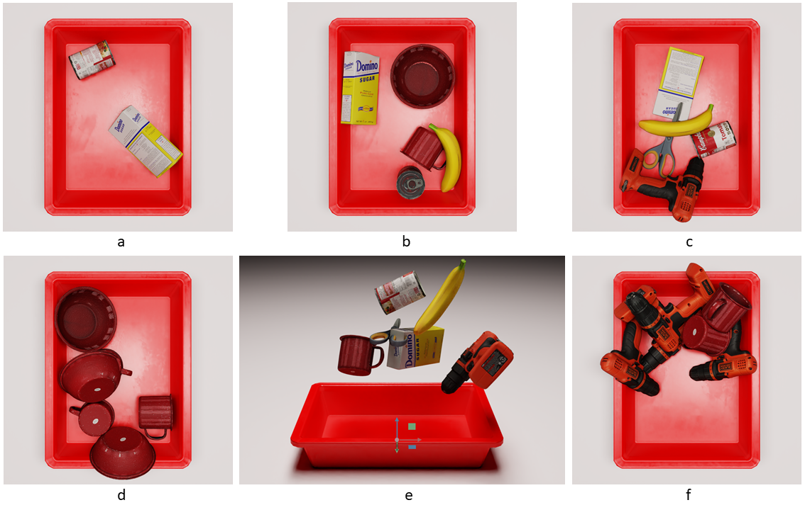
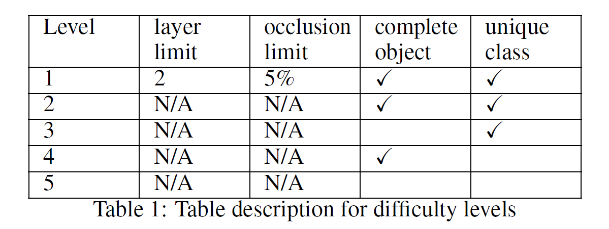
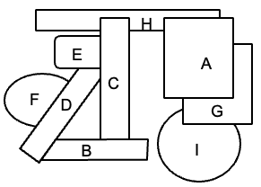
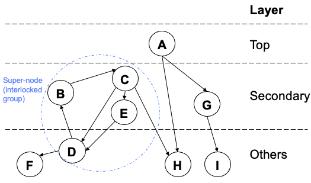

# MetaGraspNet Dataset

There has been increasing interest in smart factories powered by robotics systems to tackle repetitive, laborious tasks. One particular impactful yet challenging task in robotics-powered smart factory applications is robotic grasping: using robotic arms to grasp objects autonomously in different settings.
Robotic grasping requires a variety of computer vision tasks such as object detection, segmentation, grasp prediction, pick planning, etc. While significant progress has been made in leveraging of machine learning for robotic grasping, particularly with deep learning, a big challenge remains in the need for large-scale, high-quality RGBD datasets that cover a wide diversity of scenarios and permutations.

To tackle this big, diverse data problem, we are inspired by the recent rise in the concept of metaverse, which has greatly closed the gap between virtual worlds and the physical world. In particular, metaverses allow us to create digital twins of real-world manufacturing scenarios and to virtually create different scenarios from which large volumes of data can be generated for training models. We present MetaGraspNet: a large-scale benchmark dataset for vision-driven robotic grasping via physics-based metaverse synthesis. The proposed dataset contains 100,000 images and 25 different object types, and is split into 5 difficulties to evaluate object detection and segmentation model performance in different grasping scenarios. We also propose a new layout-weighted performance metric alongside the dataset for evaluating object detection and segmentation performance in a manner that is more appropriate for robotic grasp applications compared to existing general-purpose performance metrics. This repository contains scripts for layout-weighted performance metric.




The dataset (5 difficulties) can be accessed at:
- a) https://www.kaggle.com/metagrasp/metagraspnetdifficulty1-easy
- b) https://www.kaggle.com/metagrasp/metagraspnetdifficulty2-medium
- c) https://www.kaggle.com/metagrasp/metagraspnetdifficulty3-hard1
- d) https://www.kaggle.com/metagrasp/metagraspnetdifficulty4-hard2
- f) https://www.kaggle.com/metagrasp/metagraspnetdifficulty5-very-hard

### metagraspnet_metric.py
Contains general metagraspnet evaluation script

 

Our proposed metric focuses on evaluating top
and secondary layer objects. This is driven by the fact that in real-life practical scenarios, top and secondary layer objects have a priority to be picked, while picking the rest of objects requires moving away top and secondary layer objects. Besides evaluating model performance for top and secondary objects separately, we propose a layout-weighted metric which considers the model performance on both
top and secondary layer objects. More details can be found at: [paper link]

### modified_coco_evaluator
Contains a script to use with coco api on the AP score for segmentation evaluation


### detectron2_coco_interface
Contains a script to use with detectron2 coco api on the AP score for segmentation evaluation

You will also need to use script in modified_coco_evaluator to make it work for detectron2

## Citing MetaGraspNet

If you use MetaGraspNet dataset or metric in your research, please use the following BibTeX entry.

```BibTeX
@misc{chen2021metagraspnet,
  author =       {Yuhao Chen and E. Zhixuan Zeng and Maximilian Gilles and
                  Alexander Wong},
  title =        {MetaGraspNet},
  howpublished = {\url{https://https://github.com/y2863/MetaGraspNet}},
  year =         {2021}
}
```
